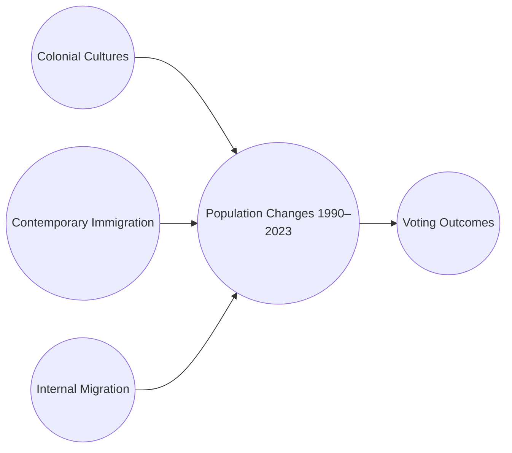

# 🇺🇸 Case Study: The Cultural DNA Behind NC, GA, and TX Voting Trends

**How Colonial Roots, Immigration, and Internal Migration Shape Today’s Politics**

---

## 🧠 Overview

This case study explores how the United States’ colonial-era settlement patterns and post-1965 immigration waves have influenced modern political behavior in **North Carolina**, **Georgia**, and **Texas**. Each state reflects a unique fusion of:

* **Colonial ancestry** from England, Scotland, Ireland, and France
* **Internal migration** (e.g., Appalachia → Detroit, NYC → Atlanta)
* **Modern immigration** (especially post-1990 Latino and Asian populations)

This regional mix helps explain political swings, cultural tensions, and party shifts from 2000 to 2020.

---

## 🗺️ Historical Foundations

| Region         | Colonial Heritage                       | Cultural Traits                                   |
| -------------- | --------------------------------------- | ------------------------------------------------- |
| North Carolina | Scots-Irish, Borderlanders              | Independent, evangelical, anti-central authority  |
| Georgia        | English (Cavalier + Quaker)             | Honor culture, economic stratification, tolerance |
| Texas          | Southern Scots-Irish + Spanish colonial | Libertarian, religious, frontier resilience       |

---

## 🧬 Migration Layers & Political Influence

### 📥 Immigration

* NC foreign-born population grew **8x since 1990**
* Latino and Asian American voters significantly altered GA and TX voting margins
* Many immigrants skew younger, more urban, and initially more Democratic

### 🛣 Internal Migration

* "Hillbilly Highway": Appalachians to Midwest and back South
* Northeastern transplants moving to Atlanta, Raleigh, Dallas

These dual movements have **layered over** original colonial subcultures.

---

## 🧭 Workflow: Cultural Evolution of Political Behavior

---

## 📊 Visuals & R Graphs

All graphs use:

* 🖤 Black background with double white axis lines
* 🪖 Military-style camouflage color palettes
* 🧾 Footnotes directly under graph titles

Run individually in RStudio with `ggplot2`, `scales`, and `tidyverse`.

### 1. NC Foreign-Born Population Growth (1990–2023)

* Shows massive post-1990 immigration wave
* Reflects real ACS and Migration Policy data

### 2. NC Racial/Ethnic Distribution (2020)

* Based on 2020 Decennial Census
* Tracks White, Black, Asian, Hispanic breakdown

### 3. Vote Share by Party in NC, GA, TX (2000–2020)

* Individual graphs + combined facet chart
* Clear evidence of GA blue shift and TX slow realignment

---

## 🔍 Sources

* U.S. Census Bureau (ACS, Decennial)
* Migration Policy Institute
* NC OSBM
* U.S. Election Atlas
* State election boards of NC, GA, TX
* Pew Research, Brookings
* David Hackett Fischer's *Albion's Seed* (colonial culture framework)

---

## 🧪 What's Next?

This project can evolve into:

* 📦 An R package or RMarkdown portfolio
* 📊 Shiny app comparing all 50 states
* 🌎 A teaching tool for civics, demography, or U.S. history

Feel free to clone, fork, or remix to apply to your own region.

---

> Made with ❤️ + 📊 + 🧠 by [Erwin Maurice McDonald](https://github.com/emcdo411)
